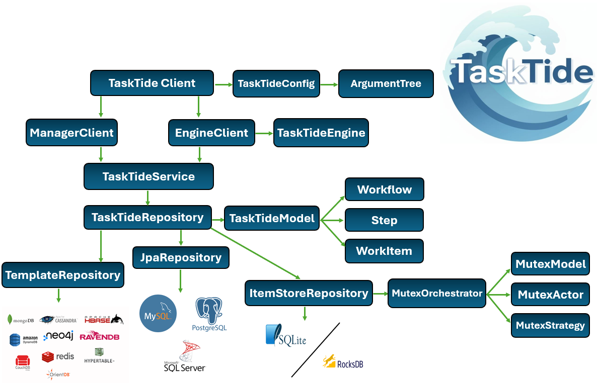

<p align="center">
  
</p>

# TaskTide

[](https://tasktide.org)
[](https://central.sonatype.com/artifact/org.tasktide/tasktide)
[](https://api-docs.tasktide.org)
[](https://doi.org/10.5281/zenodo.21959893)
[](https://github.com/BrenKenna/TaskTide/actions/workflows/gradle.yml)
[](https://github.com/BrenKenna/TaskTide/blob/main/LICENSE)


<p id="intro-a">
<strong>TaskTide</strong> is a modular <strong>Workflow Orchestration Engine</strong> designed for <strong>Cloud</strong>, <strong>HPC</strong>, <strong>Grid</strong>, and <strong>Edge Computing</strong> workloads. It enables the execution of <strong>ETL-style workflows</strong> and arbitrary <strong>Data Application</strong> as task collections.
</p>

<p id="intro-b">
By modelling <strong>Workflow</strong>, and <strong>Execution States</strong> as first-class orchestration entities. TaskTide provides its users with real-time <em>workflow registration</em>, <em>introspection</em>, and <em>lifecycle influence</em> at runtime while task are actively consumed across distributed compute resources.
</p>

<p id="intro-c">
TaskTide ships as a <strong>lightweight</strong>, <strong>daemon-less</strong>, <strong>configurable</strong> approach for workflow orchestration. That decouples <strong>Workflow Orhcestration</strong> logic from <strong>Infrastructure Specific</strong> backends. Supporting <strong>Relational</strong> (<em>Postgres, Maria, MySQL, Microsoft, Oracle etc</em>), <strong>Non-Relational</strong> (<em>MongoDB, CouchDB, Oracle etc</em>) database management systems, and <strong>daemon-less</strong> databases (<em>SQLite, RocksDB</em>) reflecting its backend-agnostic design.
</p>
<br>

---

## 🚀 Features

- 🛠️ **Pilot Job Execution Model**: Tasks are dynamically scheduled and executed inside long-running jobs.

- 🔄 **ETL-Friendly**: Tasks are treated as extraction, transformation, or loading scripts/programs.

-  **Backend Agnostic** – Works with Document (e.g. MongoDB), Daemon-less (e.g. RocksDB, SQLite), Key-Value (e.g. Redis), and Relational (e.g Postgres) stores.

- 💻 **Native Task Execution**: Runs any local or system executable/script.

- 🔀 **Nested Workflow Modeling** : Compose tasks into hierarchical workflows using a flexible domain model.

- 🧪 **Tested**: Built with CI/CD, Docker support, and integration tests across database types.
<br>

---

## 🧑‍💻 Getting Started

An installation guide tailored to variety of use-cases is [provided here](Install.md). Backend database configurations should follow provider recommendations, since [Jakarta NoSQL](https://github.com/eclipse-jnosql/jnosql-databases) brings in NoSQL support, and [JPA-Hibernate](https://www.baeldung.com/learn-jpa-hibernate) using [Hikari Data Source](https://www.baeldung.com/hikaricp) brings in SQL, whose use for TaskTide are [documented here](tasktide/tasktide/README.md#a-global-configurations).
<br>

### 💻 Running TaskTide

How TaskTide should run can be configured based on parameters in a [TaskTide Config File](configs/microprofile-config.properties), or command-line arguments. This was to simplify the use case of the Engine and Manager clients, as they are target orientated. However, when using command-line arguments the target backend parameters must be declared in that file as they are set and provided by the Jakarta-NoSQL, and JPA dependancies (if being used). Additionally since only one backend database type should be used, application runtime can be optimized by removing unused dependancies (ex JNoSQL if JPA etc) [described here](tasktide/tasktide/README.md#a-global-configurations).
<br>

```bash
# Run using parameters from TaskTide config file
.tasktide/bintasktide

# --- OR ---
.tasktide/bintasktide <client: Manager | Engine | API> <client args: -h/--help>
```

<br>

---

## 🧱 Architecture

- **Core Model**             – Defines the stateful task and workflow data structure, [described here](tasktide/core/README.md).

- **Engine Lib**             – Defines the task processing and tracking logic for WorkItems and their tasks, [described here](tasktide/engine/README.md).

- **Web API**                – Defines Jakarta-WS REST API with an embedded [Jersey](https://eclipse-ee4j.github.io/jersey.github.io/documentation/latest3x/user-guide.html), [described here](tasktide/api/README.md).

- **Mutex**                  - Defines ItemStore semaphore for acquiring a mutex on the configured RocksDB/SQLite database, described [described here](tasktide/mutex/README.md).

- **ItemStore**              - Defines an interface for configuring TaskTide with daemonless databases (RocksDB/SQLite), described [described here](tasktide/itemstore/README.md).

- **Parser**                 - Defines a configurable command-line argument tree for TaskTide, described [described here](tasktide/parser/README.md).

- **Client Application**     – Provides access and services for workflow deployments and persistence, [described here](tasktide/tasktide/README.md).

<br>
<br>

<p id="arch-b" align="center">
  
</p>