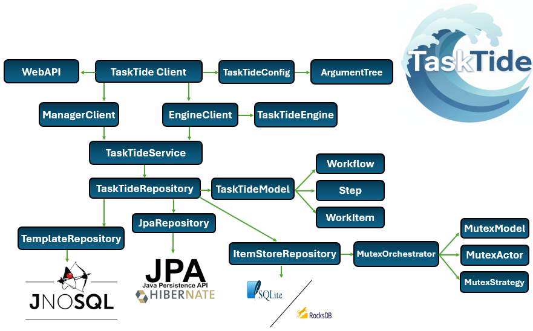

# TaskTide System

 

## 1). TaskTide-ItemStore Library
Documentation for this module can be [found here](./itemstore/) and dependant [Mutex found here](./mutex/README.md).
 

## 2). TaskTide-Core Library
Documentation for this module can be [found here](./core/README.md).
 

## 3). TaskTide-Engine Library
Documentation for this module can be [found here](./engine/README.md).
 

## 4). TaskTide Web API
Documentation for this module can be [found here](./api/README.md) embeds [Jersey](https://eclipse-ee4j.github.io/jersey.github.io/documentation/latest3x/user-guide.html) Jakarta REST implementation with [GlassFish](https://glassfish.org/docs/).

 

## 5). TaskTide Client Application
Documentation for this module can be [found here](./tasktide/README.md) and dependant [Parser found here](./parser/README.md).
 