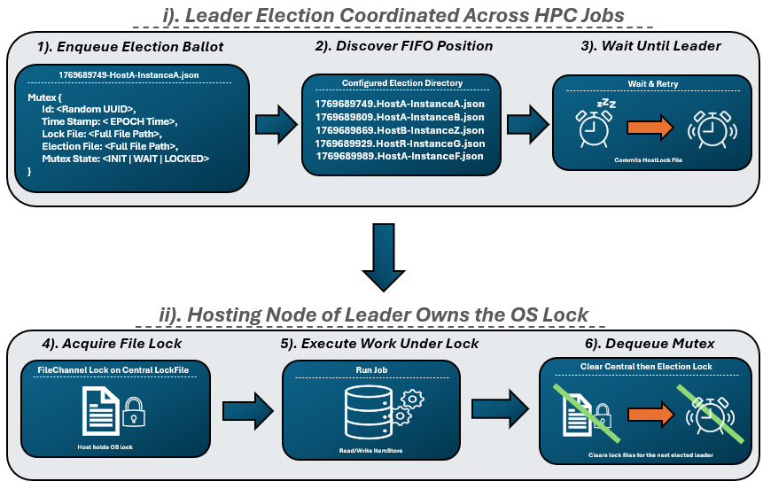

# TaskTide-Mutex Lib

Library for de-centralized file orientated semaphore across disttributed process on an NFS (shown below). Models each mutex request as a ballot for leader-election, once acquired an OS file lock is acquired on the target. Where precise ordering of read-writes is not as important having them just queued. Bucketing of this algorithm used by has been templated to be further explored by version-2.
 

The library was developed for [ItemStore](../itemstore/README.md) databases that are daemonless and file-based. So that a de-centralized read-write queue can be used for ItemStore-Repository. Allowing multiple jobs running across distinct hosts of HPC to coordinate their access patterns against target file on attached. Without requiring the submission of an additional side-car process for the job fleet. 
 

 

  

